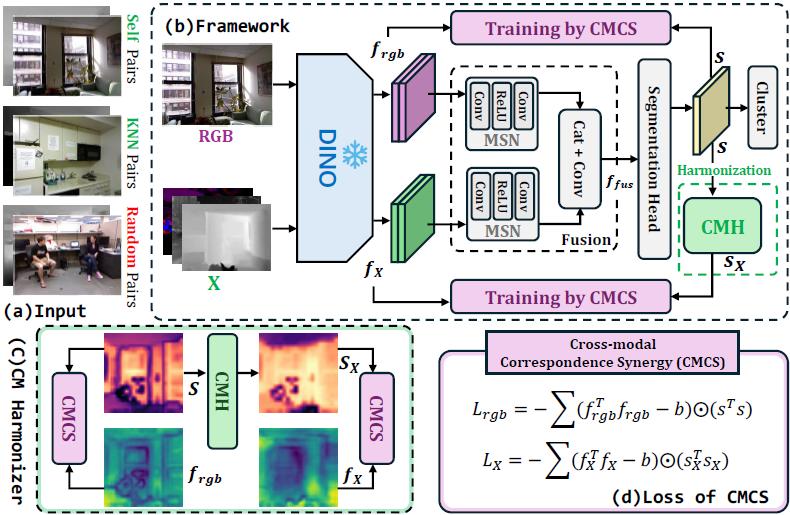

# UMSS:Towards Unsupervised Multimodal Semantic Segmentation

<p align="center">
  
</p>

<p align="center">
  <b>Official code for UniM2 on the UMSS task.</b>
</p>

<p align="center">
  <a href="#environments"><b>Environments</b></a> |
  <a href="#datasets"><b>Datasets</b></a> |
  <a href="#checkpoints"><b>Checkpoints</b></a> |
  <a href="#data-preparation"><b>Data Preparation</b></a> |
  <a href="#hyperparameter-search"><b>Hyperparameter Search</b></a> |
  <a href="#training"><b>Training</b></a> |
  <a href="#evaluation"><b>Evaluation</b></a>
</p>

## Environments

UniM2 uses a single Conda environment named `UMSS`.

```bash
conda env create -f environment.yml
conda activate UMSS
```

## Datasets

Please download the prepared dataset archives from our OneDrive links and place
them under `data/` as shown below. If your datasets live elsewhere, keep the
same internal folder structure and pass `pytorch_data_dir=/your/path`.

| Dataset | Download | Modalities Used | Config Key | Expected Root |
| :-- | :-- | :-- | :-- | :-- |
| **[NYU Depth V2](https://cs.nyu.edu/~silberman/datasets/nyu_depth_v2.html)** | **[OneDrive](https://entuedu-my.sharepoint.com/:u:/r/personal/haitian003_e_ntu_edu_sg/Documents/Project-Datasets-and-Checkpoints/UMSS/Datasets/NYU_Depth.zip?csf=1&web=1&e=7A4yoL)** | RGB + HHA/depth | `dataset_name: nyu` | `data/NYU_Depth/nyu` |
| **[MFNet](https://github.com/haqishen/MFNet-pytorch)** | **[OneDrive](https://entuedu-my.sharepoint.com/:u:/r/personal/haitian003_e_ntu_edu_sg/Documents/Project-Datasets-and-Checkpoints/UMSS/Datasets/MFNet.zip?csf=1&web=1&e=qgCWpa)** | RGB + thermal | `dataset_name: mfnet` | `data/MFNet/mfnet` |
| **[MCubeS](https://github.com/kyotovision-public/multimodal-material-segmentation)** | **[OneDrive](https://entuedu-my.sharepoint.com/:u:/r/personal/haitian003_e_ntu_edu_sg/Documents/Project-Datasets-and-Checkpoints/UMSS/Datasets/MCUBES.zip?csf=1&web=1&e=85hZ7y)** | RGB + AoLP/DoLP/NIR | `dataset_name: mcubes` | `data/MCUBES/MCubeS` |

The expected project layout is:

```text
data/
|-- NYU_Depth/
|   |-- nyu/        # raw NYU Depth V2 files from the archive
|   |-- cropped/    # generated by src/crop_datasets.py
|   `-- nns/        # generated by src/precompute_knns.py
|-- MFNet/
|   |-- mfnet/      # raw MFNet files from the archive
|   |-- cropped/
|   `-- nns/
`-- MCUBES/
    |-- MCubeS/     # raw MCubeS files from the archive
    |-- cropped/
    `-- nns/
```

The raw dataset folders (`nyu/`, `mfnet/`, and `MCubeS/`) should keep the
structure from the provided archives. `cropped/` stores the cropped training
samples used by UniM2, while `nns/` stores precomputed nearest-neighbor caches
for contrastive positive sampling.

MFNet stores RGB and thermal data in one 4-channel PNG. Keep the original
`images/*.png` files; UniM2 reads RGB from the first three channels and thermal
from the fourth channel.

The dataset we provided already contains cropped data, and you can use the command below to generate by yourself.
```bash
python src/crop_datasets.py --config-name train_config_nyu.yml
```


## Checkpoints

Download the released UniM2 checkpoints from OneDrive and place them under
`save_checkpoints/`. The exact file name is flexible; set `model_paths` in
`src/configs/eval_config.yml` to the checkpoint you want to evaluate.

| Dataset | Model | Modalities | Download | Suggested Folder |
| :-- | :-- | :-- | :-- | :-- |
| NYU Depth V2 | NYU-Depth-small | RGB + HHA/depth | - | `save_checkpoints/nyu/` |
| NYU Depth V2 | NYU-BASE | RGB + HHA/depth | **[OneDrive](https://entuedu-my.sharepoint.com/:u:/g/personal/haitian003_e_ntu_edu_sg/IQAemUSOKWXNTKU9_AW9hzE2AanUNebUhXXkc6jaBNg2dgw?e=K1EP4N)** | `save_checkpoints/nyu/` |
| MFNet | MFNet-Small | RGB + thermal | **[OneDrive](https://entuedu-my.sharepoint.com/:u:/g/personal/haitian003_e_ntu_edu_sg/IQAmx053DjttRId-yaD7GvuhAVzLpsLur3h7CUN3Iw8HTUQ?e=gysPyS)** | `save_checkpoints/mfnet/` |
| MFNet | MFNet-base | RGB + thermal | **[OneDrive](https://entuedu-my.sharepoint.com/:u:/g/personal/haitian003_e_ntu_edu_sg/IQDGKaVmHXsFTrlu4kM3ZoZzAZ8fhx4ceIBlzJ1JkqKQyHg?e=AkwHER)** | `save_checkpoints/mfnet/` |
| MCubeS | IA | RGB + AoLP | **[OneDrive](https://entuedu-my.sharepoint.com/:u:/g/personal/haitian003_e_ntu_edu_sg/IQBGOJmD0fePQbTmwr_v4en4AeO7a3ITfQweSUa9-Lv2BCg?e=bv4XWb)** | `save_checkpoints/mcubes/` |
| MCubeS | ID | RGB + DoLP | **[OneDrive](https://entuedu-my.sharepoint.com/:u:/g/personal/haitian003_e_ntu_edu_sg/IQACtr3xAtghTbOwBHlE7z9OAZSZmzDRwrlbDXJMaOxXULc?e=5NaIgo)** | `save_checkpoints/mcubes/` |
| MCubeS | IN | RGB + NIR | **[OneDrive](https://entuedu-my.sharepoint.com/:u:/g/personal/haitian003_e_ntu_edu_sg/IQD1Uxpo7Qr_S6co0Zqa7BdqAdpt2RZ6duS3mI8yxtYUjXc?e=KHzjOI)** | `save_checkpoints/mcubes/` |
| MCubeS | IND | RGB + NIR + DoLP | **[OneDrive](https://entuedu-my.sharepoint.com/:u:/g/personal/haitian003_e_ntu_edu_sg/IQDFT8zgTvaHS4-xNAFP9ExVAbWKAyzwjWXfEiYtjbX6SjU?e=ehsWqr)** | `save_checkpoints/mcubes/` |
| MCubeS | INAD | RGB + NIR + AoLP + DoLP | **[OneDrive](https://entuedu-my.sharepoint.com/:u:/g/personal/haitian003_e_ntu_edu_sg/IQB4s-XC6GCFQLCATVKoOS0RAbVxJZLwr3h6MqBVtPuPimE?e=LknDUX)** | `save_checkpoints/mcubes/` |

For MCubeS checkpoint names, `I` denotes RGB/intensity, `A` denotes AoLP,
`D` denotes DoLP, and `N` denotes NIR.


## Hyperparameter Search

The recommended workflow is to search hyperparameters first:

```bash
python src/hyperparameter_search.py \
  --config_name train_config_nyu.yml \
  --max_steps 7500 \
  --n_trials 200
```

Search results are written to `optuna_results/`.

## Training

After choosing hyperparameters, update the matching config file and train:

```bash
python src/train_segmentation.py --config-name train_config_nyu.yml
```

## Evaluation

```bash
python src/eval_segmentation.py --config-name eval_config.yml
```

Set `model_paths` and `pytorch_data_dir` in `src/configs/eval_config.yml` for
the checkpoint and dataset you want to evaluate. Raw evaluation is used by
default; set `run_crf=true` to enable CRF post-processing.
