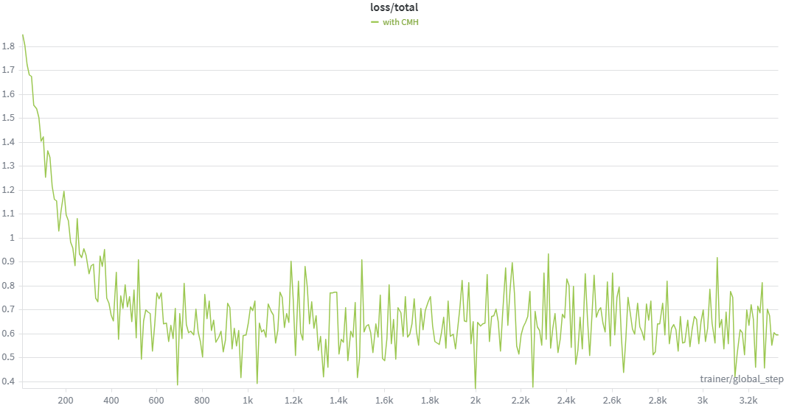
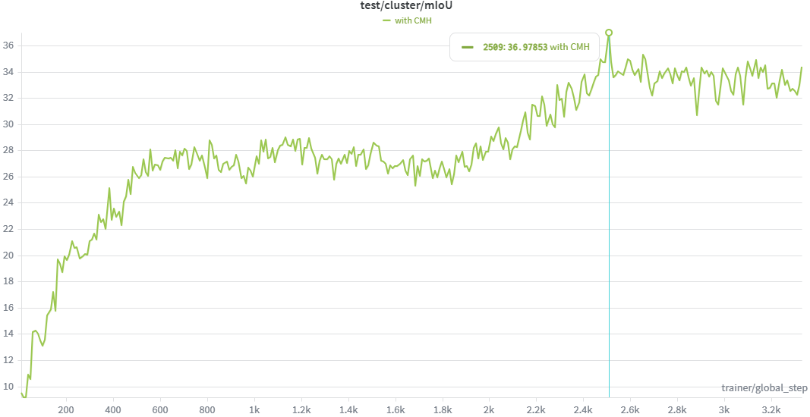

# UMSS: Towards Unsupervised Multimodal Semantic Segmentation (ECCV 2026)

<p align="center">
  
</p>

<p align="center">
  <b>Official code for UniM2 on the UMSS task.</b>
</p>

<p align="center">
  <a href="#environments"><b>Environments</b></a> |
  <a href="#datasets"><b>Datasets</b></a> |
  <a href="#checkpoints"><b>Checkpoints</b></a> |
  <a href="#data-preparation"><b>Data Preparation</b></a> |
  <a href="#hyperparameter-search"><b>Hyperparameter Search</b></a> |
  <a href="#training"><b>Training</b></a> |
  <a href="#evaluation"><b>Evaluation</b></a>
</p>

## Environments

UniM2 uses a single Conda environment named `UMSS`. We recommend installing it
with the provided script, which pins the fragile dependencies and installs
PyTorch 2.11.0 with CUDA 12.8 wheels for recent NVIDIA GPUs:

```bash
bash scripts/install_umss_env.sh
conda activate UMSS
```

If an environment named `UMSS` already exists and you want to recreate it, run:

```bash
FORCE_RECREATE=1 bash scripts/install_umss_env.sh
conda activate UMSS
```

For older GPUs or a different CUDA wheel, override `CUDA_WHEEL` and the matching
PyTorch package versions. The original `environment.yml` is kept as a compact
dependency reference, but the install script is the recommended path for
reproducible setup.

## Datasets

Please download the prepared dataset archives from our OneDrive links and place
them under `data/` as shown below. If your datasets live elsewhere, keep the
same internal folder structure and pass `pytorch_data_dir=/your/path`.

| Dataset | Download | Modalities Used | Config Key | Expected Root |
| :-- | :-- | :-- | :-- | :-- |
| **[NYU Depth V2](https://cs.nyu.edu/~silberman/datasets/nyu_depth_v2.html)** | **[OneDrive](https://entuedu-my.sharepoint.com/:u:/r/personal/haitian003_e_ntu_edu_sg/Documents/Project-Datasets-and-Checkpoints/UMSS/Datasets/NYU_Depth.zip?csf=1&web=1&e=7A4yoL)** | RGB + HHA/depth | `dataset_name: nyu` | `data/NYU_Depth/nyu` |
| **[MFNet](https://github.com/haqishen/MFNet-pytorch)** | **[OneDrive](https://entuedu-my.sharepoint.com/:u:/r/personal/haitian003_e_ntu_edu_sg/Documents/Project-Datasets-and-Checkpoints/UMSS/Datasets/MFNet.zip?csf=1&web=1&e=qgCWpa)** | RGB + thermal | `dataset_name: mfnet` | `data/MFNet/mfnet` |
| **[MCubeS](https://github.com/kyotovision-public/multimodal-material-segmentation)** | **[OneDrive](https://entuedu-my.sharepoint.com/:u:/r/personal/haitian003_e_ntu_edu_sg/Documents/Project-Datasets-and-Checkpoints/UMSS/Datasets/MCUBES.zip?csf=1&web=1&e=85hZ7y)** | RGB + AoLP/DoLP/NIR | `dataset_name: mcubes` | `data/MCUBES/MCubeS` |

The expected project layout is:

```text
data/
|-- NYU_Depth/
|   |-- nyu/        # raw NYU Depth V2 files from the archive
|   |-- cropped/    # generated by src/crop_datasets.py
|   `-- nns/        # generated by src/precompute_knns.py
|-- MFNet/
|   |-- mfnet/      # raw MFNet files from the archive
|   |-- cropped/
|   `-- nns/
`-- MCUBES/
    |-- MCubeS/     # raw MCubeS files from the archive
    |-- cropped/
    `-- nns/
```

The raw dataset folders (`nyu/`, `mfnet/`, and `MCubeS/`) should keep the
structure from the provided archives. `cropped/` stores the cropped training
samples used by UniM2, while `nns/` stores precomputed nearest-neighbor caches
for contrastive positive sampling.

MFNet stores RGB and thermal data in one 4-channel PNG. Keep the original
`images/*.png` files; UniM2 reads RGB from the first three channels and thermal
from the fourth channel.

The dataset we provided already contains cropped data, and you can use the command below to generate by yourself.
```bash
python src/crop_datasets.py --config-name=train_config_nyu.yml
```


## Checkpoints

Download the released UniM2 checkpoints from OneDrive and place them under
`save_checkpoints/`. The exact file name is flexible; set `model_paths` in
`src/configs/eval_config.yml` to the checkpoint you want to evaluate.

| Dataset | Model | Modalities | Download | Suggested Folder |
| :-- | :-- | :-- | :-- | :-- |
| NYU Depth V2 | NYU-Depth-small | RGB + HHA/depth | - | `save_checkpoints/nyu/` |
| NYU Depth V2 | NYU-BASE | RGB + HHA/depth | **[OneDrive](https://entuedu-my.sharepoint.com/:u:/g/personal/haitian003_e_ntu_edu_sg/IQAemUSOKWXNTKU9_AW9hzE2AanUNebUhXXkc6jaBNg2dgw?e=K1EP4N)** | `save_checkpoints/nyu/` |
| MFNet | MFNet-Small | RGB + thermal | **[OneDrive](https://entuedu-my.sharepoint.com/:u:/g/personal/haitian003_e_ntu_edu_sg/IQAmx053DjttRId-yaD7GvuhAVzLpsLur3h7CUN3Iw8HTUQ?e=gysPyS)** | `save_checkpoints/mfnet/` |
| MFNet | MFNet-base | RGB + thermal | **[OneDrive](https://entuedu-my.sharepoint.com/:u:/g/personal/haitian003_e_ntu_edu_sg/IQDGKaVmHXsFTrlu4kM3ZoZzAZ8fhx4ceIBlzJ1JkqKQyHg?e=AkwHER)** | `save_checkpoints/mfnet/` |
| MCubeS | IA | RGB + AoLP | **[OneDrive](https://entuedu-my.sharepoint.com/:u:/g/personal/haitian003_e_ntu_edu_sg/IQBGOJmD0fePQbTmwr_v4en4AeO7a3ITfQweSUa9-Lv2BCg?e=bv4XWb)** | `save_checkpoints/mcubes/` |
| MCubeS | ID | RGB + DoLP | **[OneDrive](https://entuedu-my.sharepoint.com/:u:/g/personal/haitian003_e_ntu_edu_sg/IQACtr3xAtghTbOwBHlE7z9OAZSZmzDRwrlbDXJMaOxXULc?e=5NaIgo)** | `save_checkpoints/mcubes/` |
| MCubeS | IN | RGB + NIR | **[OneDrive](https://entuedu-my.sharepoint.com/:u:/g/personal/haitian003_e_ntu_edu_sg/IQD1Uxpo7Qr_S6co0Zqa7BdqAdpt2RZ6duS3mI8yxtYUjXc?e=KHzjOI)** | `save_checkpoints/mcubes/` |
| MCubeS | IND | RGB + NIR + DoLP | **[OneDrive](https://entuedu-my.sharepoint.com/:u:/g/personal/haitian003_e_ntu_edu_sg/IQDFT8zgTvaHS4-xNAFP9ExVAbWKAyzwjWXfEiYtjbX6SjU?e=ehsWqr)** | `save_checkpoints/mcubes/` |
| MCubeS | INAD | RGB + NIR + AoLP + DoLP | **[OneDrive](https://entuedu-my.sharepoint.com/:u:/g/personal/haitian003_e_ntu_edu_sg/IQB4s-XC6GCFQLCATVKoOS0RAbVxJZLwr3h6MqBVtPuPimE?e=LknDUX)** | `save_checkpoints/mcubes/` |

For MCubeS checkpoint names, `I` denotes RGB/intensity, `A` denotes AoLP,
`D` denotes DoLP, and `N` denotes NIR.

## Training
### 1. Preparation

Before training:

1. Download the [DINOv3](https://github.com/facebookresearch/dinov3) **ViT-B/16** and **ViT-S/16** checkpoints and place them in `UniM2/pretrained/`.
2. Set `pytorch_data_dir` in the configuration file to your dataset path, e.g., `./__dataset__/UMSS/NYU_Depth`.

### 2. Precompute nearest neighbors

Following [STEGO](https://github.com/mhamilton723/STEGO), we first precompute nearest neighbors for contrastive positive samples:

```bash
python src/precompute_knns.py --config-name=train_config_nyu.yml
```

For convenience, the precomputed nearest-neighbor files are already included in our released dataset. Therefore, this step can be skipped if you use the provided data.

### 3. Hyperparameter search
Unsupervised semantic segmentation methods are usually sensitive to hyperparameter choices. We therefore recommend
performing hyperparameter search for each dataset and model setting:

```bash
python src/hyperparameter_search.py --config_name train_config_nyu.yml
```

The search results provide the recommended hyperparameters for the corresponding configuration.

### 4. Train the segmentation model

After obtaining the searched hyperparameters, fill them into the corresponding configuration file, i.e., `src/configs/train_config_dataset.yml`. Then run:

```bash
python src/train_segmentation.py --config-name=train_config_nyu.yml
```

You can replace `train_config_dataset.yml` with the configuration file for other datasets.

Note: Hydra-based scripts in this repository use the equals-sign form
`--config-name=...`. The hyperparameter search script is argparse-based and
therefore uses `--config_name ...`.

### 5. Monitor training with Weights & Biases

We recommend using [Weights & Biases](https://wandb.ai/) to monitor UniM2
training. Before launching training, run `wandb login` and set `entity` in the
corresponding config if you want logs to appear under a specific W&B team or
account. During training, W&B is useful for checking the contrastive loss and
validation mIoU curves.

<p align="center">
  
  
</p>


## Evaluation


```bash
python src/eval_segmentation.py --config-name=eval_config.yml
```

Set `model_paths` and `pytorch_data_dir` in `src/configs/eval_config.yml` for
the checkpoint and dataset you want to evaluate. Raw evaluation is used by
default; set `run_crf=true` to enable CRF post-processing.
